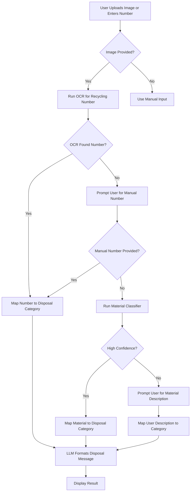
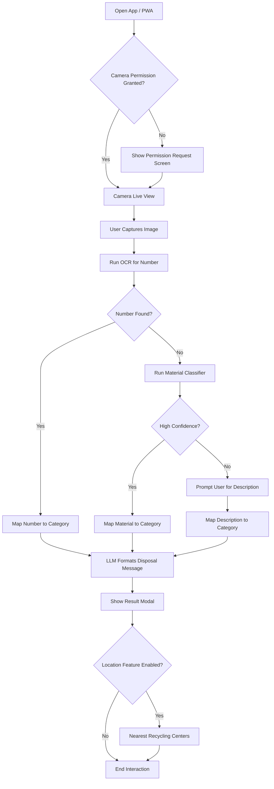

# Epic: Recycling Assistant — Tier 1 & Tier 2 Scope (Updated)

## Summary
We are building a lightweight **Recycling Assistant** that helps users determine how to dispose of an item: **recycle**, **compost**, **trash**, or **special disposal**.  
Tier 1 delivers the core workflow (upload → detect recycling number → fallback classification → LLM message).  
Tier 2 adds camera integration, PWA support, and location-based guidance.

---

## Tier 1: MVP Scope (Web App)

### User Flow
1. User uploads an image **or** enters a recycling number manually.  
2. If an image is uploaded, attempt OCR extraction of the recycling symbol/number.  
3. If OCR succeeds → map recycling number → disposal category.  
4. If OCR fails → prompt user for manual input.  
5. If user input is absent or ambiguous → run image-based material classifier (plastic/paper/cardboard/glass/metal/etc.).  
6. If classifier confidence is high → map material → disposal category.  
7. If classifier confidence is low → prompt user via modal for a brief description (“What material is this mostly?”).  
8. Use the resolved category (recycling number or material type) to map → disposal rules.  
9. LLM formats final user-facing disposal message.  
10. Display result (category, instructions, confidence, retry option).

### Functional Requirements
- Accept image upload (PNG/JPG).  
- Accept manual recycling-number input fallback.  
- OCR for “♺ #” extraction.  
- Material classifier for fallback when number is absent.  
- User prompt modal for clarification if classifier is low confidence.  
- Mapping from recycling number/material → disposal category.  
- LLM message formatter.  
- Simple, mobile-friendly UI.

### Non-Functional Requirements
- No authentication required.  
- Deployment via static hosting + Next.js API routes.  
- Images processed transiently (no storage).  
- Response time target: < 3s.  
- Lightweight OCR + classifier.

---

## Tier 1 Mermaid Diagram (Overall Flow)

## Tier 2: Expanded Features (PWA + Location Tools)

### Added Functionality

-   Camera capture via `<input capture="environment">` or `getUserMedia`.
    
-   Installable PWA with offline caching.
    
-   Local recycling center lookup.
    
-   Location-based rule mapping for disposal guidance.
    
-   Improved UX for quick scanning.

### Tier 2 Mermaid Diagram (Camera + PWA Flow)

# UX Wireframes
TBD; I'll swing back with proper wireframes/mockups soon.
