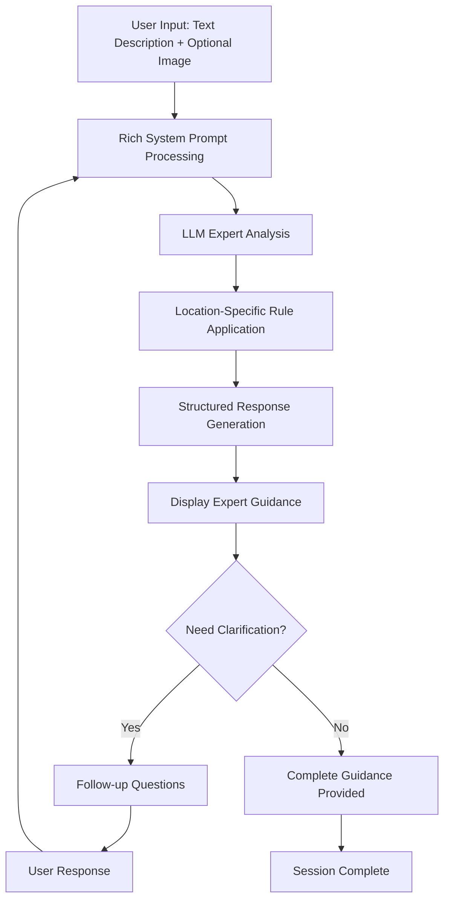

# RecyclAI — AI-Powered Recycling Consultant

> _Expert recycling guidance through intelligent conversation_

**Sprint #3 LLM Application:** RecyclAI transforms recycling guidance from complex object detection into expert consultation. Our AI serves as a knowledgeable recycling expert, providing comprehensive disposal guidance through text descriptions and progressive image enhancement.

## 🚀 Quickstart

### Prerequisites

- **Node.js 18+** (LTS recommended)
- **npm** or **yarn**
- **Git**

### 1. Clone & Install

```bash
git clone https://github.com/Peleke/recyclai.git
cd recyclai
npm install
```

### 2. Development Server

```bash
# Start development server with Turbopack (5-10x faster builds)
npm run dev

# Server starts at http://localhost:3000
# Hot reload enabled - changes update instantly
```

### 3. Available Commands

```bash
# Development
npm run dev          # Start dev server with Turbopack
npm run build        # Build for production
npm start           # Start production server

# Testing
npm test            # Run unit tests (Jest + React Testing Library)
npm run test:watch  # Run tests in watch mode
npm run test:e2e    # Run end-to-end tests (Playwright)
npm run test:all    # Run all tests

# Quality
npm run lint        # ESLint checking
npm run type-check  # TypeScript type checking
```

### 4. Project Features

🎨 **Beautiful UI**: Neomorphic design with Lottie animations
⚡ **Turbopack**: 5-10x faster builds than traditional bundlers
🧪 **Full Testing**: Jest + Playwright for comprehensive coverage
📱 **Mobile-First**: Responsive design optimized for all devices
♿ **Accessible**: WCAG 2.1 AA compliant
🔄 **Hot Reload**: Instant updates during development

### 5. Development Workflow

1. **Start Development:**
   ```bash
   npm run dev
   ```

2. **Make Changes:**
   - Components in `app/components/`
   - Styles in `app/globals.css`
   - API routes in `app/api/`

3. **Test Changes:**
   ```bash
   npm run test:watch  # Unit tests
   npm run test:e2e    # E2E tests
   ```

4. **Type Check:**
   ```bash
   npm run type-check
   ```

5. **Ready to Deploy:**
   ```bash
   npm run build && npm start
   ```

### 6. Key Files to Know

- `app/page.tsx` - Homepage with spectacular animations
- `app/layout.tsx` - Root layout and metadata
- `app/components/` - React components
- `app/globals.css` - Global styles and animations
- `package.json` - Dependencies and scripts
- `next.config.js` - Next.js configuration

**🎭 Pro Tip:** Toggle the development status bar with `Ctrl/Cmd + \`` for debugging info!

---

## Core Innovation
**The Problem:** Complex OCR and image classification solve the wrong problem—users know what they have, they need expert guidance on proper disposal.

**Our Solution:** LLM as Recycling Expert with rich system prompts, location-aware disposal rules, and conversational guidance that feels like talking to a real environmental consultant.

---

## Phase 1: MVP — Image-Enhanced Text Consultation

### User Flow (Simplified)
1. **Input Options:** Text description OR upload image + describe item
2. **Expert Analysis:** LLM processes description with comprehensive recycling knowledge
3. **Location Context:** System includes user location for specific disposal rules
4. **Expert Guidance:** Detailed disposal instructions + local resources + environmental education
5. **Structured Output:** Clear disposal method, local centers, why it matters

### Core Features
- **Dual Input Mode:** Text description (primary) + optional image reference
- **AI Expert Consultant:** Rich system prompt with recycling symbol knowledge, material properties, disposal rules
- **Location Awareness:** ZIP code integration for municipal-specific guidance
- **Structured Responses:** Disposal method + local resources + educational context
- **Conversation Flow:** Follow-up questions for complex items (batteries in electronics, etc.)

### Technical Implementation
- **LLM Core:** OpenAI API with pre-configured expert system prompt
- **Variables:** `{item_description}`, `{user_location}`, `{has_image: boolean}`, `{complexity_level}`
- **Response Format:** JSON structure for disposal method, instructions, local resources, confidence
- **Framework:** Next.js with form interface and API routes
- **Sprint #3 Compliance:** System prompts, structured input/output, no external tools

---

## Phase 2: Vision Upgrade — Direct Image Analysis

### Enhanced Flow
1. **Visual Input:** Upload image → GPT-4V direct analysis → Item identification
2. **Reduced Friction:** Text description becomes optional/validation
3. **Same Expert Output:** Maintains comprehensive disposal guidance format
4. **Progressive UX:** "Upload photo and we'll figure out what it is"

### Technical Upgrade
- **Vision API:** Switch to OpenAI GPT-4V for image analysis
- **Enhanced Prompts:** System prompt handles both text and visual context
- **Same Output:** Maintains structured response format for consistency
- **Backward Compatible:** Text mode still available for complex items

---

## System Prompt Architecture

### Core Persona
```
Role: Expert Recycling and Environmental Consultant
Knowledge: Comprehensive recycling symbols (1-7), material properties, disposal methods
Context: Location-specific municipal rules, hazardous waste protocols
Personality: Helpful, knowledgeable, environmentally conscious, educational
```

### Input Variables
- `{item_description}`: User's text description of item
- `{user_location}`: ZIP code or city for local disposal rules
- `{has_image}`: Boolean flag for enhanced context
- `{complexity_level}`: Simple item vs. complex multi-material disposal

### Output Structure
```json
{
  "disposal_method": "recycle|compost|trash|special_disposal|hazardous_waste",
  "instructions": "Specific step-by-step disposal guidance",
  "local_resources": "Nearest recycling centers, hazardous waste days",
  "why_it_matters": "Environmental impact education",
  "confidence": "high|medium|low",
  "follow_up_questions": ["For complex items requiring clarification"]
}
```

---

## Flow Diagram (LLM-Centric)



## Progressive Enhancement Roadmap

### Phase 1 (MVP - Week 1)
- ✅ Text-based expert consultation
- ✅ Image upload for user reference
- ✅ Sprint #3 requirement compliance
- ✅ Location-aware disposal guidance

### Phase 2 (Vision - Week 2)
- 🔄 GPT-4V direct image analysis
- 🔄 Optional text descriptions
- 🔄 Enhanced "magic" factor

### Phase 3 (Future - Post-Sprint)
- 📋 Multi-turn conversations for complex items
- 📋 Municipal database integration
- 📋 Gamified environmental education

---

## Sprint #3 Requirement Alignment

✅ **System Prompts with Variables:** Rich recycling expert prompt with location and context variables
✅ **Structured Input/Output:** Form input → JSON response format for immediate UI use
✅ **Well-defined Prompt Structure:** Pre-configured expert persona with variable placeholders
✅ **Multiple LLM Calls:** Optional follow-up questions for complex disposal scenarios
✅ **No Tools/MCP:** Pure LLM API calls with structured prompts
✅ **Makes It Pop:** Expert-level guidance that surprises users with depth and local specificity

---

## Demo Video Structure

1. **Text Mode Demo:** "Old smartphone" → Expert disposal guidance with local resources
2. **Image Mode Demo:** Upload photo → Enhanced description → Same expert analysis
3. **System Prompt Showcase:** Show prompt structure and variable substitution in playground
4. **Response Parsing:** Highlight JSON structure feeding directly into clean UI
5. **"Holy Shit" Moment:** Depth of knowledge and local specificity from simple inputs

**Bonus Comparison:** Phase 1 (text) vs Phase 2 (vision) showing progressive enhancement without losing expert quality.

---

## Project Structure

### Directory Organization

```
recyclai/
├── app/                    # Next.js 16 App Router
│   ├── components/         # React components
│   │   ├── ui/            # UI primitives and base components
│   │   ├── RecyclAIBot.tsx # Lottie animation bot component
│   │   ├── TypewriterText.tsx # Typewriter effect component
│   │   └── StatusBar.tsx  # Development status bar
│   ├── api/               # API routes
│   │   ├── consult/       # Consultation endpoint (/api/consult)
│   │   └── location/      # Location endpoint (/api/location)
│   ├── globals.css        # Global styles and animations
│   ├── layout.tsx         # Root layout with metadata
│   └── page.tsx           # Homepage with animations
├── lib/                   # Business logic and utilities
├── prompts/               # LLM system prompts and templates
├── public/                # Static assets
│   ├── lottie/           # Lottie animation files
│   │   └── animations/   # Animation assets
│   └── icons/            # PWA icons and favicons
├── docs/                  # Project documentation
│   ├── prd.md            # Product Requirements Document
│   ├── architecture.md   # System architecture
│   └── sprint-artifacts/ # Sprint deliverables
└── e2e/                   # End-to-end tests (Playwright)
```

### Architecture Patterns

**Feature-Based Organization:** Each major feature gets its own directory structure for scalability

**API Route Separation:** Consultation and location services have dedicated API directories

**Component Hierarchy:** UI primitives in `/ui`, feature components in root `/components`

**Asset Organization:** Lottie animations and PWA assets organized by type

**Business Logic Isolation:** Core logic separated in `/lib` for testability

**System Prompt Management:** LLM prompts organized in dedicated `/prompts` directory

---

_Transforming recycling guidance from complex detection to expert conversation — one LLM call at a time._